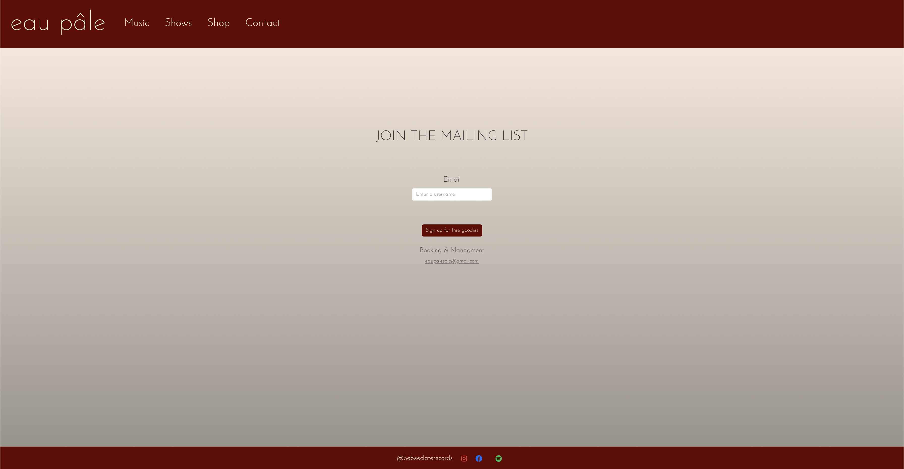

# EAU PÂLE OFFICIAL WEBSITE

This website was generated with React version 18.2.0. It is a client-side website created using React Typescript and Sass. It needs to be connected to an actual server-side database in order to operate some of the actions possible on the site.

# TECHNOLOGIES USED

- Html
- Css
- Typescript
- React
- Node
- React Bootstrap
- React-dom
- React-router-dom
- Sass
- Babel
- Eslint
- Github/gh-pages

# FEATURES

- Users can visit different pages from the website.
- Users can be redirected to social media links.
- Users can add or remove articles from a shopping basket.
- Users can send an email to the website's email address.

# DEVELOPMENT SERVER

Run `npm start` for a dev server. Navigate to `http://localhost:3030`. The application will automatically reload if you change any of the source files.

# WHAT IT LOOKS LIKE

